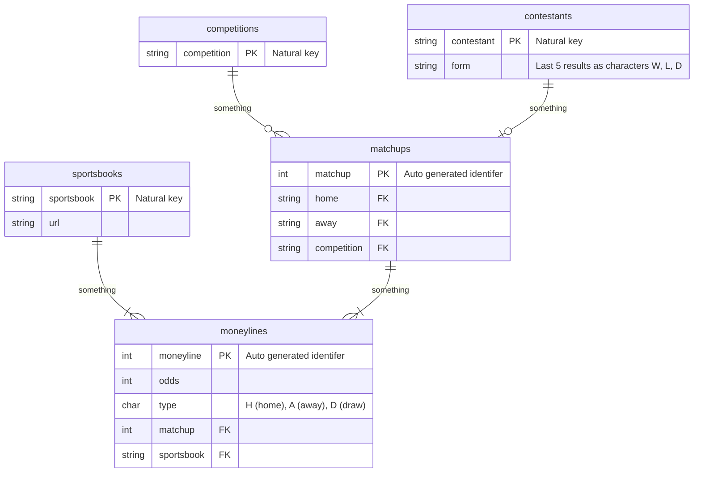

```mermaid

erDiagram
  sportsbooks ||--|{ moneylines : something
  sportsbooks {
    string sportsbook PK "Natural key"
    string url
  }
  
  competitions ||--o{ matchups : something
  competitions {
    string competition PK "Natural key"
  }
  
  contestants ||--o| matchups : something
  contestants {
    string contestant PK "Natural key"
    string form "Last 5 results as characters W, L, D"
  }
  
  matchups ||--|{ moneylines : something
  matchups {
    int matchup PK "Auto generated identifer"
    string home FK
    string away FK
    string competition FK
  }
  
  moneylines {
    int moneyline PK "Auto generated identifer"
    int odds
    char type "H (home), A (away), D (draw)"
    int matchup FK
    string sportsbook FK
  }

```
